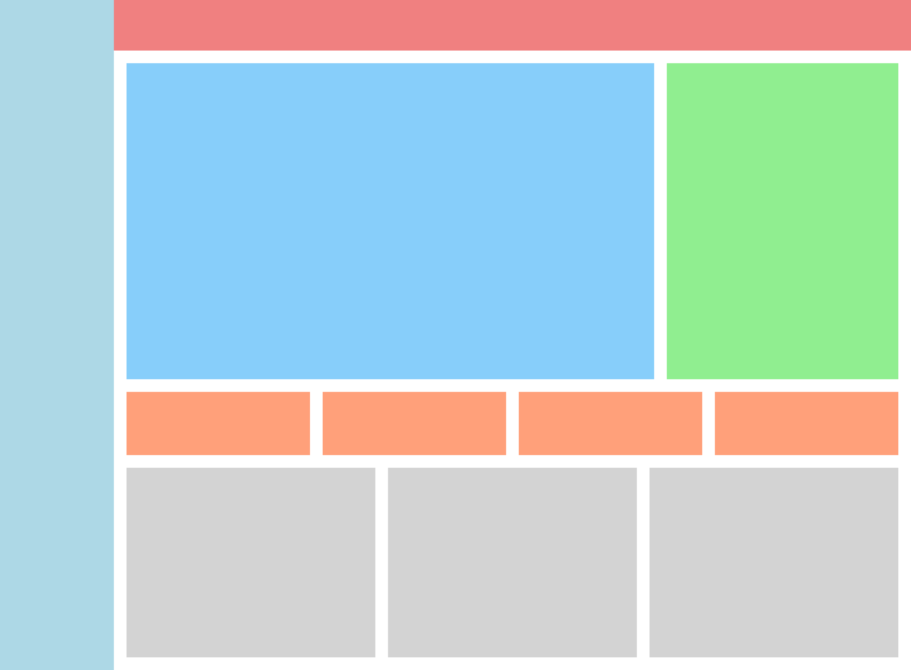

# CSS Grid 作業 1 - 儀表板佈局切版

###### 作業層級

HTML/CSS 基礎 **/** CSS Grid **/** 作業 1

## 作業說明及相關資源

恭喜你學完 Grid 的操作！！！在這份作業中我們會切出類似在課程中做的儀表板的佈局，這份作業將不會提供任何既有的 html 及 css 架構，會稍微有點燒腦，相信你一定能做到，GO GO GO！

### 成品

#### 成品圖

#### 成品規格

參考 [Figma 設計檔](./design.fig)

## 作業驗收及提交

### 作業驗收標準

| 挑戰等級 | 驗收標準             | 敘述                   |
| -------- | -------------------- | ---------------------- |
| 銅牌     | 成品呈現             | 成品呈現與成品規格相符 |
| 銀牌     | 該作業無銀牌挑戰項目 | N/A                    |
| 金牌     | 該作業無金牌挑戰項目 | N/A                    |

### 作業提交

完成作業後休息一下，接著看詳解，了解一下自己的答案是不是跟自己寫的相同，如果有問題不要忘記要問像助教提問呦
