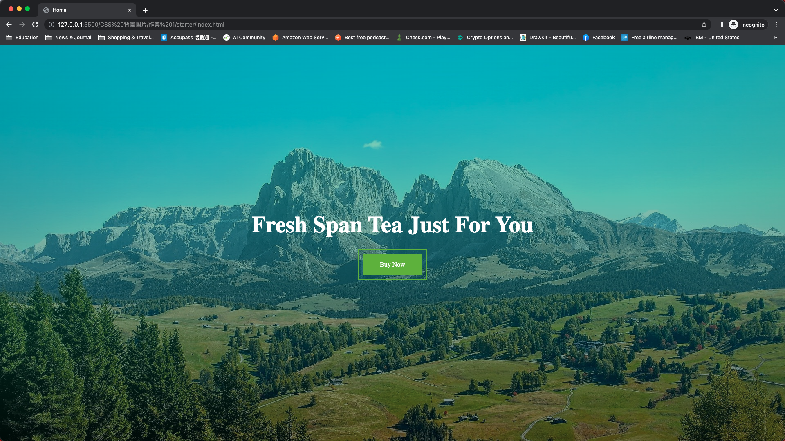
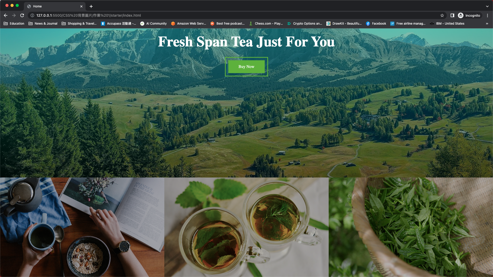

# CSS 背景圖片 作業 1 - Landing Page 切版

###### 作業層級

HTML/CSS 基礎 **/** CSS 背景圖片 **/** 作業 1

## 作業說明及相關資源

在學習完 Flex 跟 Grid 之後，我們接著要來利用先前學習的知識配上背景圖片的技巧做出產品的著陸頁（Landing Page）；在這個練習中，我們會不會提供任何的 HTML 與 CSS 檔案給你（但會提供成品中的照片檔），這次練習的強度就沒有像是先前這麼強了，可以放鬆心情練習（但要記得看詳解嘿）

### 成品

#### 成品圖

#### 成品規格

盡可能切出與成品圖相符的頁面即可

## 作業驗收及提交

### 作業驗收標準

| 挑戰等級 | 驗收標準             | 敘述                         |
| -------- | -------------------- | ---------------------------- |
| 銅牌     | 成品呈現             | 成品呈現與成品規格盡可能相符 |
| 銀牌     | 該作業無銀牌挑戰項目 | N/A                          |
| 金牌     | 該作業無金牌挑戰項目 | N/A                          |

### 作業提交

完成作業後休息一下，接著看詳解，了解一下自己的答案是不是跟自己寫的相同，如果有問題不要忘記要問像助教提問呦
