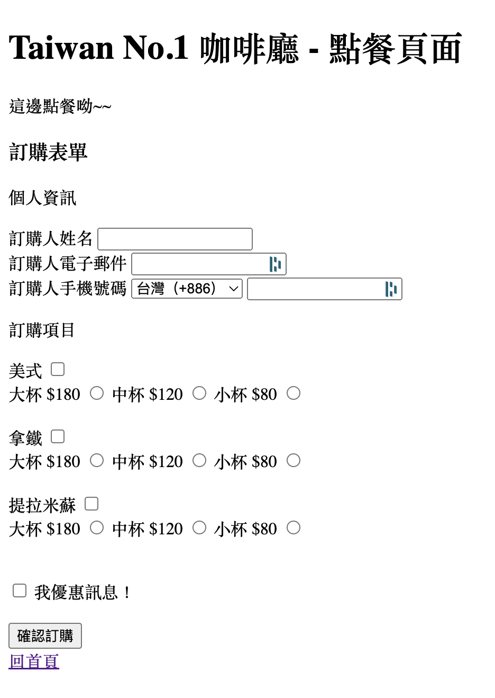

# HTML/CSS 常見元素作業 1 - 咖啡聽網站

###### 作業層級

HTML/CSS 基礎 **/** HTML 常見元素 **/** 作業 1

## 作業說明及相關資源

在這份作業中，你受到 Taiwan No. 1 的咖啡廳委託，協助製作他們咖啡廳的網站，他們需要你協助製作他們的官方網頁，這個網頁一共有兩個頁面，分別為 **首頁** 以及 **點餐頁面**，成品圖如下：

### 首頁

#### 首頁成品圖

#### 首頁規格

1. Taiwan No.1 咖啡廳為 `h1` 標題
2. 我們的咖啡是世界好喝的喔...(以下省略) 為段落
3. 菜單為 `h3` 標題
4. 表格中照片尺寸寬高為 100 \* 100
5. 點餐連結欄位中的「立即點餐連結」可以跳轉到 [點單頁](order.html)，跳轉需要開一個新的頁面

### 點餐頁

#### 點餐成品圖

#### 點餐頁規格

1. Taiwan No.1 咖啡廳 - 點餐頁面為 `h1` 標題
2. 這邊點餐喔為段落
3. 訂購表單為 `h3` 標題
4. 成品中「回首頁！」的連結可以跳轉到 [首頁](index.html)，跳轉需要開一個新的頁面
5. 表單中「訂購人姓名」、「訂購人電子郵件」、「訂購人手機號碼」」及「我要優惠訊息！」為必填/選之選項

### 作業提供資源

1. [首頁](./index.html) 以及 [點單頁](order.html) 的起始範例檔，請直接接續起始檔案完成此作業
2. 專案所需的照片請至 img 資料中使用對應的照片（注意不要使用到成品圖的照片呦~~）

## 作業驗收及提交

### 作業驗收標準

| 挑戰等級 | 驗收標準               | 敘述                                                             |
| -------- | ---------------------- | ---------------------------------------------------------------- |
| 銅牌     | 首頁呈現               | 首頁成品需於示意圖一致，並符合規格要求                           |
| 銅牌     | 首頁 **立即點餐** 連結 | 首頁的每個 **立即點餐** 連結需能跳轉到點餐頁面，跳轉需另開新頁面 |
| 銅牌     | 點餐頁呈               | 首頁成品需於示意圖一致，並符合規格要求                           |
| 銅牌     | 點餐頁 **回首頁** 連結 | 點餐頁的 **回首頁** 連結需能回到首頁，跳轉需另開新頁面           |
| 銀牌     | 該作業無銀牌挑戰項目   | N/A                                                              |
| 金牌     | 該作業無金牌挑戰項目   | N/A                                                              |

### 作業提交

完成作業後休息一下，接著看詳解，了解一下自己的答案是不是跟自己寫的相同，如果有問題不要忘記要問像助教提問呦
